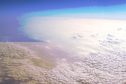
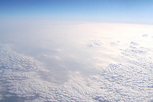
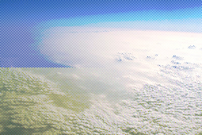
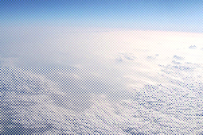

# srgb-mix

Tool to create pictures that show one thing when scaled sRGB-compliantly and another thing when not.

This can be used for creating test images for sRGB-correct scaling, or "hidden messages" in images that are hidden in thumbnails but show in large views or vice versa, depending on which scaling algorithm each use. Direct 1:1 pixel display on a monitor can be assumed to be sRGB here, however on HiDPI monitors, some scaling usually takes place and has to be factored in.

## Samples

### darken_l

Here, the linear image is a darkening overlay to be shown when scaling/blurring assuming linear color values:

```
go run . -in_linear in/flag.png -in_srgb in/clouds.png -out out/darken_l.png -strength 1 -mode darken_l
```

[](out/darken_l.png)

### lighten_s

Here, the sRGB image is a brightening overlay to be shown when scaling/blurring assuming sRGB color values:

```
go run . -in_linear in/clouds.png -in_srgb in/flag.png -out out/lighten_s.png -strength 1 -mode lighten_s
```

[](out/lighten_s.png)

### mix_l

Here, the linear image is a target to be shown when scaling/blurring assuming linear color values, and setting the strength reduces its influence:

```
go run . -in_linear in/flag.png -in_srgb in/clouds.png -out out/mix_l.png -strength 1 -mode mix_l
```

[](out/mix_l.png)

### mix_s

Here, the sRGB image is a target to be shown when scaling/blurring assuming sRGB color values, and setting the strength reduces its influence:

```
go run . -in_linear in/clouds.png -in_srgb in/flag.png -out out/mix_s.png -strength 1 -mode mix_s
```

[](out/mix_s.png)

