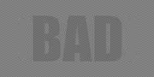

# srgb-mix

Tool to create pictures that show one thing when scaled sRGB-compliantly and another thing when not.

This can be used for creating test images for sRGB-correct scaling, or "hidden messages" in images that are hidden in thumbnails but show in large views or vice versa, depending on which scaling algorithm each use. Direct 1:1 pixel display on a monitor can be assumed to be sRGB here, however on HiDPI monitors, some scaling usually takes place and has to be factored in.

## Samples

Find out which of the two thumbnails the big image looks like for you in each of these!
The left thumbnail assumes stupid linear scaling, the right thumbnail was scaled sRGB-correctly.

As a bonus, play with your browser's page zoom (Ctrl-Plus and Ctrl-Minus) and see if you can get the other one.

### darken_l

Here, the linear image is a darkening overlay to be shown when scaling/blurring assuming linear color values:

```
go run . -in_linear in/flag.png -in_srgb in/clouds.png -out out/darken_l.png -strength 1 -mode darken_l
```

[](out/darken_l.png)

[](thumbnails/darken_l-linear.png)
[](thumbnails/darken_l-srgb.png)

Note that this changes nothing where the `in_linear` image is white, and brightens most where the `in_linear` image is black.

### lighten_s

Here, the sRGB image is a brightening overlay to be shown when scaling/blurring assuming sRGB color values:

```
go run . -in_linear in/clouds.png -in_srgb in/flag.png -out out/lighten_s.png -strength 1 -mode lighten_s
```

[](out/lighten_s.png)

[](thumbnails/lighten_s-linear.png)
[](thumbnails/lighten_s-srgb.png)

Note that this changes nothing where the `in_srgb` image is black, and brightens most where the `in_srgb` image is white.

### mix_l

Here, the linear image is a target to be shown when scaling/blurring assuming linear color values, and setting the strength reduces its influence:

```
go run . -in_linear in/flag.png -in_srgb in/clouds.png -out out/mix_l.png -strength 1 -mode mix_l
```

[](out/mix_l.png)

[](thumbnails/mix_l-linear.png)
[](thumbnails/mix_l-srgb.png)

Note that this only works where the `in_linear` image is darker than the `in_srgb` one.

### mix_s

Here, the sRGB image is a target to be shown when scaling/blurring assuming sRGB color values, and setting the strength reduces its influence:

```
go run . -in_linear in/clouds.png -in_srgb in/flag.png -out out/mix_s.png -strength 1 -mode mix_s
```

[](out/mix_s.png)

[](thumbnails/mix_s-linear.png)
[](thumbnails/mix_s-srgb.png)

Note that this only works where the `in_srgb` image is brighter than the `in_linear` one.

### -preference ls

This mode does not consider one of the images strictly more important than the other, but tries to build an image where both color values are fulfilled as closely as possible.

Should not be used in conjunction with `-strength`, and the `-mode` needs to be either `mix_s` or `mix_l`, which do the same when `-strength` is unset.

```
go run . -in_linear in/linear.png -in_srgb in/srgb.png -out out/pref_ls.png -mode mix_s -preference ls
```

[](out/pref_ls.png)

[](thumbnails/pref_ls-linear.png)
[](thumbnails/pref_ls-srgb.png)

Note that this only works where the `in_linear` image is darker than the `in_srgb` one, and it cannot be much darker.

### Note

Thumbnails were generated with:

```
cd out
for x in *.png; do
	convert "$x" -geometry 50% "../thumbnails/${x%.png}-linear.png"
	convert "$x" -colorspace RGB -geometry 50% -colorspace sRGB "../thumbnails/${x%.png}-srgb.png"
done
```

All examples can be regenerated by running:

	sed -e '/```/,/```/!d; /```/d' README.md | sh
